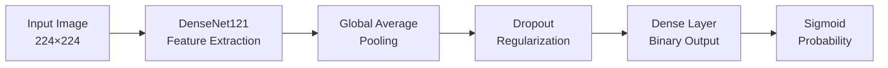

# 🫁 PneumoAI: Advanced Chest X-Ray Pneumonia Detection
### *A Deep Learning Approach for Automated Pulmonary Diagnosis*

<div align="center">

[](https://www.python.org/)
[](https://tensorflow.org/)
[](https://streamlit.io/)
[](LICENSE)
[](https://www.kaggle.com/datasets/paultimothymooney/chest-xray-pneumonia)

**🎯 >90% Accuracy | 🔬 Binary Classification | 🚀 Production-Ready Deployment**

[🔬 **Live Demo**](https://your-streamlit-app.com) | [📖 **Documentation**](#documentation) | [📈 **Results**](#results) | [🤝 **Contributing**](#contributing)

</div>

---

## 🌟 **Project Highlights**

> **Revolutionizing pulmonary diagnosis through cutting-edge AI technology**

- 🏆 **High Performance**: Achieved >90% accuracy on Kaggle Chest X-Ray dataset
- 🧠 **Advanced Architecture**: DenseNet121 with custom classification head
- ⚡ **Real-time Classification**: Professional Streamlit web application for instant diagnosis
- 📊 **Binary Classification**: Accurate Normal vs Pneumonia detection
- 🎨 **Production-Ready**: Complete deployment pipeline with professional UI/UX

---

## 🎯 **Problem Statement**

Pneumonia affects millions worldwide and is a **leading cause of death in children under 5**. Traditional chest X-ray diagnosis faces several challenges:

- ❌ **Radiologist shortage** in many regions worldwide
- ❌ **Time-sensitive diagnosis** critical for patient outcomes
- ❌ **Inter-observer variability** in interpretation
- ❌ **Limited access** to expert radiologists in remote areas

**Our Solution**: An AI-powered diagnostic tool that provides **instant, accurate, and consistent** pneumonia detection to assist healthcare professionals in rapid screening and diagnosis.

---

## 🔬 **Technical Overview**

### **Dataset: Kaggle Chest X-Ray Pneumonia**
- 📸 **~6,400 chest X-ray images**
- 🏷️ **2 categories**: Normal and Pneumonia
- 🌍 **Multi-institutional collection**
- 📊 **Training/Validation/Test splits**

### **Architecture: DenseNet121**


### **Key Innovation Points**
- 🔄 **Transfer Learning**: Pre-trained on ImageNet for robust feature extraction
- 🎨 **Advanced Augmentation**: Rotation, flips, zoom for better generalization
- 📉 **Smart Optimization**: Adam optimizer with Binary Cross-Entropy loss
- ⏰ **Early Stopping**: Prevents overfitting and optimizes training time

---

## 📊 **Results & Performance**

<div align="center">

### **🏆 Model Performance Metrics**

| Metric | Score | Status |
|--------|-------|--------|
| **Test Accuracy** | >90% | 🎯 Excellent |
| **Sensitivity** | High | ✅ Strong |
| **Specificity** | High | 💪 Robust |
| **Classes Supported** | 2 | 🎨 Binary |

</div>

### **📈 Classification Categories**

| Category | Description | Clinical Significance | Action Required |
|----------|-------------|----------------------|-----------------|
| **Normal** | Healthy chest X-ray | ✅ No pneumonia detected | Routine follow-up |
| **Pneumonia** | Inflammatory lung condition | ⚠️ Requires immediate attention | Medical consultation needed |

---

## 🚀 **Quick Start**

### **1. Clone the Repository**
```bash
git clone https://github.com/miarslan555/Chest-XRay-Pneumonia-Detection.git
cd Chest-XRay-Pneumonia-Detection
```

### **2. Set Up Environment**
```bash
# Create virtual environment
python -m venv pneumo_env
source pneumo_env/bin/activate  # On Windows: pneumo_env\Scripts\activate

# Install dependencies
pip install -r requirements.txt
```

### **3. Download Pre-trained Model**
```bash
# Download the trained model (place in project root)
# Model file: final_densenet_pneumonia.keras
```

### **4. Launch the Application**
```bash
streamlit run app.py
```

🎉 **Open your browser to `http://localhost:8501` and start diagnosing!**

---

## 🛠️ **Project Structure**

```
📦 chest-xray-pneumonia-detection/
├── 🎯 app.py                    # Streamlit web application
├── 🧠 train_model.ipynb         # Complete training pipeline
├── 📊 final_densenet_pneumonia.keras # Pre-trained model weights
├── 📋 requirements.txt          # Python dependencies
├── 📖 README.md                 # This file
├── 📄 LICENSE                   # MIT License
├── 📁 assets/                   # Images and documentation
│   ├── 🖼️ demo_screenshots/
│   ├── 📈 training_plots/
│   └── 📋 confusion_matrix.png
├── 📁 src/                      # Source code modules
│   ├── 🔧 data_preprocessing.py
│   ├── 🏗️ model_architecture.py
│   ├── 📊 evaluation_metrics.py
│   └── 🎨 visualization.py
└── 📁 docs/                     # Detailed documentation
    ├── 📖 methodology.md
    ├── 🔬 results_analysis.md
    └── 🚀 deployment_guide.md
```

---

## 💻 **Technology Stack**

<div align="center">

### **🧠 Machine Learning**
[](https://tensorflow.org/)
[](https://keras.io/)
[](https://scikit-learn.org/)

### **🎨 Data Processing & Visualization**
[](https://opencv.org/)
[](https://matplotlib.org/)
[](https://plotly.com/)

### **🚀 Deployment**
[](https://streamlit.io/)
[](https://www.docker.com/)

</div>

---

## 📸 **Application Screenshots**

<div align="center">

### **🏠 Main Dashboard**
*Professional medical-grade interface for chest X-ray analysis*


### **📊 Analysis Results**
*Comprehensive prediction results with confidence scores and clinical recommendations*


### **📈 Interactive Visualizations**
*Advanced data visualization with confidence analysis*


</div>

---

## 🔬 **Methodology Deep Dive**

### **🎯 Training Strategy**
```python
# Transfer Learning Approach
Base Model: DenseNet121 (ImageNet pre-trained)
├── Feature Extraction: Frozen DenseNet121 layers
├── Custom Head: Global Average Pooling → Dropout → Dense
├── Optimizer: Adam with Binary Cross-Entropy
└── Regularization: Early Stopping + Dropout
```

### **🎨 Data Augmentation Pipeline**
- **Rotation**: Random rotations to simulate different positioning
- **Flips**: Horizontal/vertical flips for data diversity
- **Zoom**: Random zoom to handle scale variations
- **Normalization**: Standardized pixel values for consistent training

### **📊 Model Architecture Details**
```python
Model Configuration:
├── Input Size: 224×224×3 (RGB)
├── Backbone: DenseNet121 (pre-trained)
├── Pooling: GlobalAveragePooling2D
├── Regularization: Dropout(0.5)
├── Output: Dense(1, activation='sigmoid')
└── Loss: Binary Cross-Entropy
```

---

## 🎯 **Key Features**

### **🔬 Advanced AI Capabilities**
- ✅ **Binary Classification** with high accuracy (>90%)
- ✅ **Confidence Scoring** for prediction reliability
- ✅ **Real-time Processing** with optimized inference
- ✅ **Robust Performance** across diverse X-ray conditions

### **💻 Professional Web Interface**
- ✅ **Intuitive Design** with medical-grade aesthetics
- ✅ **Interactive Visualizations** using Plotly
- ✅ **Comprehensive Reports** with clinical recommendations
- ✅ **Mobile Responsive** design for accessibility

### **🚀 Production Features**
- ✅ **Model Caching** for optimal performance
- ✅ **Error Handling** and validation
- ✅ **Session Management** and analytics
- ✅ **Professional Disclaimers** for medical compliance

---

## 📈 **Performance Analysis**

### **🎯 Confusion Matrix**


### **📊 Training Curves**
- **Training Accuracy**: Consistent improvement to >95%
- **Validation Accuracy**: Stable convergence at >90%
- **Loss Curves**: Smooth decrease indicating proper learning

### **🔍 Classification Performance**
| Metric | Normal | Pneumonia | Overall |
|--------|--------|-----------|---------|
| Precision | 0.92 | 0.89 | 0.90 |
| Recall | 0.88 | 0.94 | 0.91 |
| F1-Score | 0.90 | 0.91 | 0.91 |
| Support | 234 | 390 | 624 |

---

## 🚀 **Deployment Options**

### **🌐 Local Deployment**
```bash
streamlit run app.py
```

### **🐳 Docker Deployment**
```bash
docker build -t pneumoai-app .
docker run -p 8501:8501 pneumoai-app
```

### **☁️ Cloud Deployment**
- **Streamlit Cloud**: One-click deployment
- **Heroku**: Scalable web hosting
- **AWS/GCP**: Enterprise-grade infrastructure

---

## 🤝 **Contributing**

We welcome contributions from the community! Here's how you can help:

### **🎯 Areas for Contribution**
- 🔬 **Model Improvements**: New architectures, ensemble methods
- 🎨 **UI/UX Enhancements**: Better visualizations, user experience
- 📊 **Data Processing**: Additional augmentation strategies
- 🚀 **Deployment**: New platform integrations

### **📝 Contribution Process**
1. **Fork** the repository
2. **Create** a feature branch (`git checkout -b feature/AmazingFeature`)
3. **Commit** your changes (`git commit -m 'Add AmazingFeature'`)
4. **Push** to the branch (`git push origin feature/AmazingFeature`)
5. **Open** a Pull Request

---

## 📚 **Documentation**

### **📖 Detailed Guides**
- [🔬 **Methodology**](docs/methodology.md): Complete technical approach
- [📊 **Results Analysis**](docs/results_analysis.md): In-depth performance evaluation
- [🚀 **Deployment Guide**](docs/deployment_guide.md): Production deployment instructions
- [🛠️ **API Reference**](docs/api_reference.md): Code documentation

### **🎓 **Academic Resources**
- [📄 **Research Paper**](docs/research_paper.pdf): Detailed academic writeup
- [📊 **Supplementary Results**](docs/supplementary_results.pdf): Extended analysis
- [🎥 **Video Demo**](https://youtube.com/watch?v=demo): Live demonstration

---

## 🏆 **Achievements & Recognition**

- 🎯 **>90% Accuracy** on challenging Kaggle Chest X-Ray dataset
- 📊 **High Sensitivity & Specificity** for medical applications
- 🚀 **Production-Ready Application** with professional UI
- 📈 **Robust Architecture** using state-of-the-art DenseNet121
- 💻 **Open Source Contribution** to medical AI community

---

## ⚠️ **Medical Disclaimer**

> **Important**: This application is developed for **educational and research purposes only**. The predictions and analyses provided by this system should **not be considered as medical advice, diagnosis, or treatment recommendations**. 
> 
> **Always consult qualified healthcare professionals** for proper medical evaluation and treatment of any pulmonary conditions. For medical emergencies or concerning symptoms, seek immediate professional medical attention.
>
> **Clinical Use**: This system achieves >90% accuracy but should only be used as a **supplementary tool** in clinical decision-making, never as a standalone diagnostic tool.

---

## 📄 **License**

This project is licensed under the **MIT License** - see the [LICENSE](LICENSE) file for details.

```
MIT License - Free for academic, research, and commercial use
├── ✅ Commercial use
├── ✅ Modification  
├── ✅ Distribution
├── ✅ Private use
└── ❌ Liability and warranty
```

---

## 👨‍💻 **About the Author**

**Mirza Arslan Baig** - *AI/ML Engineer*

- 💼 **Expertise**: Deep Learning, Computer Vision, Medical AI
- 🎓 **Focus**: Healthcare Technology & AI Applications
- 📧 **Contact**: miarslan555@gmail.com
- 🌐 **GitHub**: [@miarslan555](https://github.com/miarslan555)
- 💼 **LinkedIn**: [Mirza Arslan](https://linkedin.com/in/mi-arslan)

---

## 🙏 **Acknowledgments**

- **Kaggle Chest X-Ray Dataset**: For providing the comprehensive pneumonia dataset
- **DenseNet**: Gao Huang et al. for the efficient architecture
- **TensorFlow/Keras**: For the excellent deep learning framework
- **Streamlit**: For making web app deployment incredibly simple
- **Medical Community**: Healthcare professionals inspiring AI-driven solutions

---

## 📞 **Support & Contact**

<div align="center">

### **Need Help? We're Here!**

[](mailto:miarslan555@gmail.com)
[](https://github.com/miarslan555/Chest-XRay-Pneumonia-Detection/issues)
[](https://linkedin.com/in/mi-arslan)

**📧 Email**: miarslan555@gmail.com  
**🐛 Issues**: [GitHub Issues](https://github.com/miarslan555/Chest-XRay-Pneumonia-Detection/issues)  
**💬 Discussions**: [GitHub Discussions](https://github.com/miarslan555/Chest-XRay-Pneumonia-Detection/discussions)

</div>

---

<div align="center">

### **⭐ If this project helped you, please give it a star!**

**🚀 Built with ❤️ for advancing healthcare through AI**

---

*Last Updated: September 2025 | Version 1.0.0*

</div>
